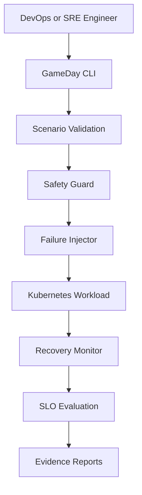

# Cloud Resilience GameDay Orchestrator

[](https://github.com/hemantsharma2189/cloud-resilience-gameday-orchestrator/actions/workflows/ci.yml)
[](https://github.com/hemantsharma2189/cloud-resilience-gameday-orchestrator/actions/workflows/container.yml)
[](https://www.python.org/)
[](https://kubernetes.io/)
[](LICENSE)

A safety-first Kubernetes resilience engineering platform that validates failure scenarios, performs controlled pod-failure experiments, measures recovery objectives, evaluates SLO objectives and generates evidence reports.

## Why this project?

Traditional monitoring tells engineers when something has failed. This project proactively tests whether a Kubernetes workload can recover before a real production incident occurs.

It demonstrates practical DevOps and SRE concepts:

- Chaos and resilience engineering
- Kubernetes self-healing validation
- SLO-based release and recovery decisions
- Human approval for destructive operations
- Automated incident evidence generation
- CI/CD testing and container security scanning

## Architecture



Detailed design: [docs/architecture.md](docs/architecture.md)

## Core capabilities

- YAML-based GameDay scenario definitions
- Strict Pydantic configuration validation
- Dry-run mode enabled by default
- Protected Kubernetes namespace policy
- Explicit approval requirement for live execution
- Controlled Kubernetes pod termination
- Deployment recovery monitoring
- Recovery-time, availability and error-rate evaluation
- JSON and Markdown report generation
- Secure non-root Docker container
- Automated Python testing and linting
- Container build and Trivy vulnerability scanning

## Repository structure

```text
.
├── src/gameday/
│   ├── cli.py
│   ├── config.py
│   ├── evaluator.py
│   ├── injector.py
│   ├── models.py
│   ├── recovery.py
│   ├── reporter.py
│   ├── runner.py
│   └── safety.py
├── scenarios/
│   └── pod-crash-dry-run.yaml
├── kubernetes/
│   └── demo-app.yaml
├── tests/
├── docs/
├── Dockerfile
└── .github/workflows/
```

## Run safely without Kubernetes

Install the project:

```bash
python -m pip install -e ".[dev]"
```

Run the default dry-run scenario:

```bash
gameday scenarios/pod-crash-dry-run.yaml
```

The dry run validates the complete control flow without connecting to Kubernetes or deleting resources.

## Run with Docker

Build the image:

```bash
docker build -t gameday-orchestrator .
```

Execute the safe scenario:

```bash
docker run --rm gameday-orchestrator
```

## Optional local Kubernetes demonstration

Deploy the demo workload to a disposable local cluster:

```bash
kubectl apply -f kubernetes/demo-app.yaml
```

Verify the workload:

```bash
kubectl get pods -n gameday-demo
```

Live execution must only be used in an authorized disposable environment. Change `dry_run` to `false` and provide explicit approval:

```bash
export GAMEDAY_APPROVED=true
gameday scenarios/pod-crash-dry-run.yaml
```

Never run failure experiments against production or any cluster you do not own or have permission to test.

## Success criteria

Each scenario defines measurable objectives:

```yaml
success_criteria:
  max_recovery_seconds: 120
  minimum_availability_percent: 99.0
  maximum_error_rate_percent: 5.0
```

A GameDay passes only when all configured objectives are satisfied.

## Automated validation

GitHub Actions automatically performs:

1. Python dependency installation
2. Ruff linting and formatting validation
3. Unit testing
4. Test coverage collection
5. Docker image build
6. Safe container dry-run
7. Trivy vulnerability scanning

## Current implementation status

- Dry-run scenario validation: Complete
- Pod-crash failure injection: Complete
- Safety and approval policies: Complete
- Deployment recovery monitoring: Complete
- SLO result evaluation: Complete
- JSON and Markdown reporting: Complete
- CI and container security scanning: Passing
- Production deployment: Not performed
- CPU, network and dependency failure injection: Planned extensions

## Author

**Hemant Sharma**

- GitHub: [hemantsharma2189](https://github.com/hemantsharma2189)
- LinkedIn: [hemantsharma20](https://www.linkedin.com/in/hemantsharma20/)
- Portfolio: [hemantsharma2189.github.io](https://hemantsharma2189.github.io/)

## License

Licensed under the [MIT License](LICENSE).
