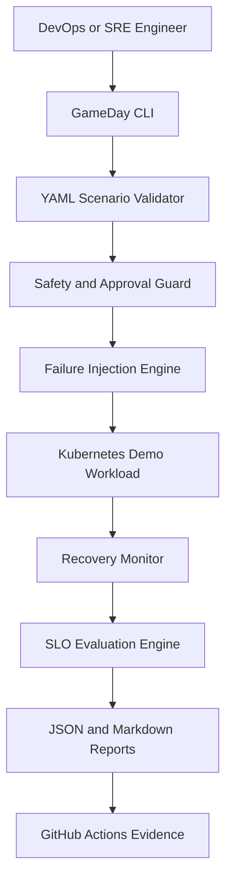

# Cloud Resilience GameDay Architecture

## Execution flow

1. The engineer selects a YAML GameDay scenario.
2. Pydantic validates the scenario and success criteria.
3. Safety policies block protected namespaces and unauthorized live execution.
4. The injector performs a dry run or controlled Kubernetes pod termination.
5. The recovery monitor measures how quickly the Deployment becomes healthy.
6. The SLO engine evaluates recovery time, availability and error rate.
7. JSON and Markdown evidence reports are generated automatically.
8. GitHub Actions validates code, runs tests, builds the container and performs security scanning.

## Safety model

- Dry-run mode is enabled by default.
- Kubernetes system namespaces are protected.
- Live execution requires explicit approval.
- Only controlled pod-crash injection is supported for live execution.
- AWS infrastructure is not required.
